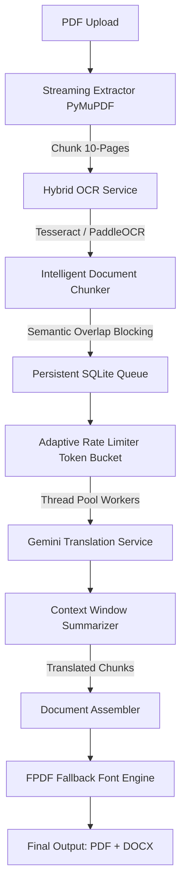

# 🇮🇳 Indic-Language PDF OCR & Translation Pipeline

An advanced, production-ready Flask web application designed to natively parse, extract, and accurately translate highly complex documents (including large 1000+ page PDFs) spanning Indic languages like **Gujarati, Hindi, Marathi, and Sanskrit**. 

Built with enterprise-scale architecture to handle colossal text processing tasks while actively respecting external API rate limitations and preventing silent memory failures.

  

## 🏗️ Technical Architecture Overview

To process 1000+ page datasets robustly, the application does not simply loop through pages. It routes payloads through an asynchronous queue-backed framework:



### 1. ⚙️ Hybrid Parallel OCR Strategy
* Dynamically routes page analysis between **Tesseract 5** (leveraged heavily utilizing isolated language packs for pristine Indic script accuracy) and **PaddleOCR** (for generalized CJK/European workloads).
* Images are streamed out of `fitz` matrices into PIL objects without loading the entire PDF into system memory.

### 2. 🧠 Intelligent Semantic Chunking
* Uses sliding window contextual matching.
* Detects headers, table barriers, and titles using programmatic heuristics, ensuring chunk splits never chop a sentence or table dataset in half mid-translation.
* Pre-scores chunk priority logic using critical keyword matching.

### 3. 🛡️ Resilient LLM Management (Token Bucket Limiters)
* Native integration of the new `google-genai` SDK mapped to `gemini-2.5-flash`.
* Features an **Adaptive Token Bucket** algorithm maintaining strict boundaries under the Free Tier limits (max 14 requests per minute). 
* Any 429 `RESOURCE_EXHAUSTED` responses trigger a *Jittered Exponential Backoff* (15s → 30s → 60s) dynamically across threads.

### 4. 🗄️ Persistence & Checkpointing
* Massive jobs are stored incrementally to an SQLite `processing_queue.db`.
* If the server trips, goes offline, or restarts, the pipeline reads `document_checkpoints` to resume seamlessly without re-OCRing or re-API calling completed segments.

### 5. 🖨️ FPDF Adaptive Rendering
* Safely dodges common `latin-1` layout crashes entirely utilizing dynamically linked Unicode TTF integrations (`Nirmala.ttf`, `Arial`) to inject `₹` and Devanagari natively into compiled output PDFs.

---

## 🛠️ Prerequisites

* **Python 3.10+**
* **Tesseract-OCR**: Ensure Tesseract is installed mapped to PATH, equipped with standard `.traineddata` files inside `tessdata` (`guj`, `hin`, `san`, `mar`).
* **PostgreSQL** configured locally.
* **uv** highly recommended for dependency management.

## 💻 Getting Started

### 1. Installation

```bash
# Clone the repository
git clone https://github.com/mokshpunamiya/Translation_hindi_gujrati_sanskrit_ocr.git
cd Translation_hindi_gujrati_sanskrit_ocr

# Install the dependencies natively using uv
uv sync
```

### 2. Environment Configuration
Create a `.env` file at the root of the project:

```env
# Google Gemini SDK Key
GEMINI_API_KEY=your_gemini_api_key_here

# PostgreSQL Database Credentials
DB_HOST=localhost
DB_USER=postgres
DB_PASSWORD=your_db_password
DB_NAME=pdf_ocr_db

# Application Admin Accounts
ADMIN_USERNAME=admin
ADMIN_PASSWORD=pdfocr
SECRET_KEY=your_secure_flask_secret_key
```

### 3. Startup

```bash
# First start will trigger the app/models/database.py to
# execute schema.sql and build all missing tables automatically.

uv run python run.py
```

Navigate to `http://localhost:5000` via your web browser to sign up.

## 📁 Repository Map

* `app/api/`: Flask Blueprint routers mapping secure logins.
* `app/services/large_doc/`: Massive file scaling systems (Pipeline, Chunker, RateLimiter).
* `app/models/`: Database pooling handling PG interactions.

---
*Built intricately for precise formatting preservation and indic-script endurance.*
